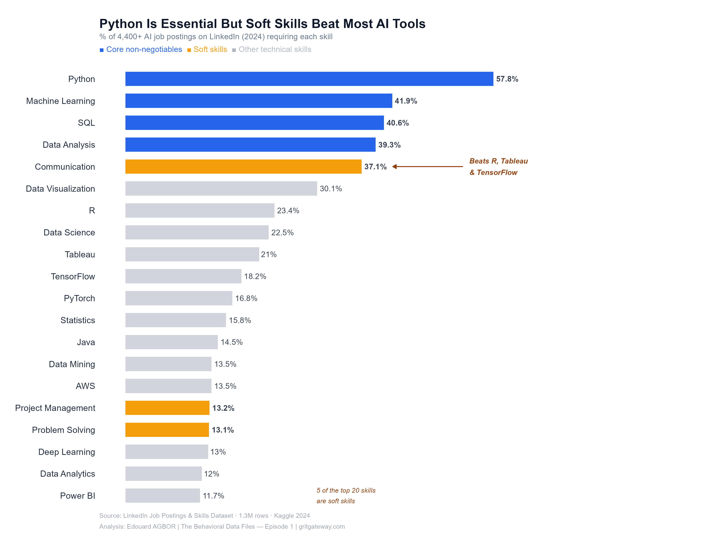
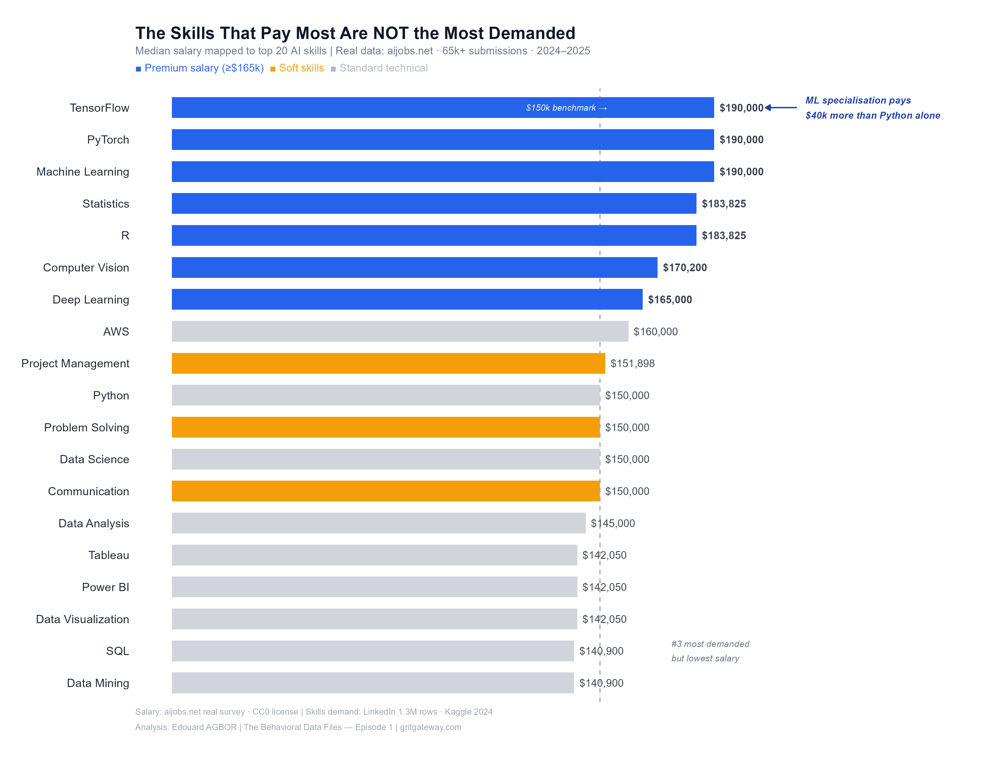

# The Behavioral Data Files

Public data analyses answering career and behavioral 
questions using real publicly available data.

**By Edouard AGBOR** | Founder, GritGateway | 
M.S. Applied Human-Centered AI, Syracuse University | Msc. Smart Manufacturing, Aston University

---

## Episodes

| # | Question | Status |
|---|---|---|
| 01 | What skills get you hired in AI — and what do they pay? | ✅ Published |
| 02 | Do students who study abroad return home? | 📅 Coming |
| 03 | What predicts employee burnout? | 📅 Coming |

---

## Episode 1 — AI Skills & Salary Analysis

### The Charts





### Key Findings
- Python appears in **57.8%** of AI job postings
- Communication ranks #5 — above R, Tableau and TensorFlow
- TensorFlow maps to **$190,000** median salary
- SQL is demanded by 40% of jobs but pays only $140,900
- Only **0.3%** of all LinkedIn jobs are explicitly AI roles

### Data Sources

| Dataset | Source | Rows | License |
|---|---|---|---|
| LinkedIn Job Postings & Skills | [Kaggle — asaniczka](https://www.kaggle.com/datasets/asaniczka/1-3m-linkedin-jobs-and-skills-2024) | 1.3M | Public |
| AI/ML Salary Survey | [aijobs.net via GitHub](https://github.com/foorilla/ai-jobs-net-salaries use this https://raw.githubusercontent.com/foorilla/ai-jobs-net-salaries/main/salaries.csv) | 151,445 | CC0 |

### Tools
R · data.table · tidyverse · ggplot2 · ggtext

Visualisation principles: [Storytelling with Data](https://www.storytellingwithdata.com/) 
by Cole Nussbaumer Knaflic

### Read The Full Analysis
[LinkedIn Article — Episode 1](https://www.linkedin.com/pulse/what-13-million-linkedin-job-postings-actually-say-ai-agbor-gcixc/?trackingId=u6F%2F7eHLQsKvL420iVLZNw%3D%3D)

---

## How To Reproduce This Analysis

1. Clone this repository:
```bash
git clone https://github.com/edouard-agbor/behavioral-data-files.git
```

2. Download the raw data:
   - [LinkedIn Skills Dataset](https://www.kaggle.com/datasets/asaniczka/1-3m-linkedin-jobs-and-skills-2024)
   - [Salary Survey Data](https://github.com/foorilla/ai-jobs-net-salaries)

3. Place CSV files in `data/raw/`

4. Open `scripts/01_ai_skills_analysis.Rmd` in RStudio

5. Knit the document — all charts reproduce automatically

---

## Repository Structure

behavioral-data-files/
├── data/
│   ├── raw/          ← download raw data here (not in repo)
│   └── clean/        ← processed results
├── scripts/
│   └── 01_ai_skills_analysis.Rmd
├── outputs/
│   └── plots/
│       ├── 01_top_ai_skills.png
│       └── 02_salary_by_skill.png
└── README.md

---

## Connect
- LinkedIn: [Edouard AGBOR](https://www.linkedin.com/in/agbor-edouard-ransome-52a755150/)
- GritGateway: [gritgateway.com](https://gritgateway.com)
- The Behavioral Data Files: follow on LinkedIn